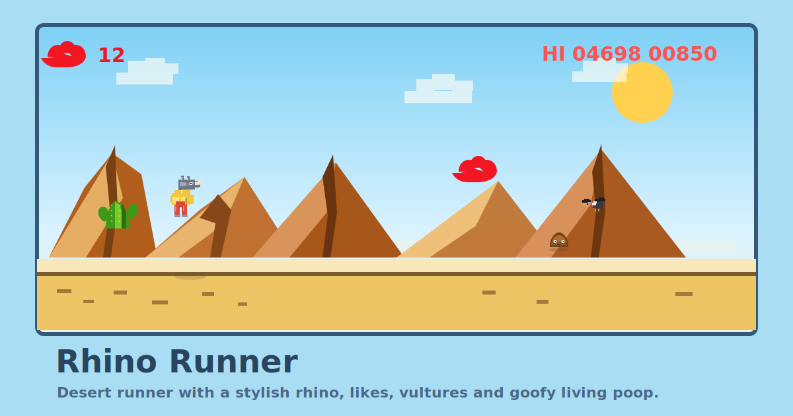

# Rhino Runner

Яркий браузерный раннер в духе Chrome Dino, но вместо динозавра здесь бежит антропоморфный носорог (Шедеврум) в желтой куртке и красных штанах.

**Играть онлайн:** [abroskinp.github.io/rhino-runner](https://abroskinp.github.io/rhino-runner/)



## Об игре

Rhino Runner - это быстрая аркада про бег, прыжки и сбор лайков по дороге.  
Носорог автоматически несется вперед, перепрыгивает препятствия, пригибается под угрозами и собирает сердечки в воздухе.

## Что есть в игре

- бесконечный раннер с ростом скорости
- смена дня и ночи по ходу забега
- кактусы, камни и летающие враги
- лайки-сердечки, которые нужно собирать в прыжке
- отдельный счетчик лайков в интерфейсе
- звук прыжка, шагов, столкновений, награды и праздника за каждые 10 лайков
- публикация через GitHub Pages с автоматическим обновлением после `git push`

## Управление

- `Space` или `ArrowUp` - прыжок
- `ArrowDown` - пригнуться
- `R` - начать заново

## Локальный запуск

```bash
npm install
npm run dev
```

## Сборка

```bash
npm run build
```

## Публикация

Проект настроен так, что GitHub Pages обновляется автоматически после отправки изменений в ветку `main`.

Обычный порядок такой:

```bash
git add .
git commit -m "Update game"
git push
```

После этого GitHub сам пересоберет игру и обновит сайт по адресу:

[https://abroskinp.github.io/rhino-runner/](https://abroskinp.github.io/rhino-runner/)

## Технологии

- TypeScript
- Vite
- HTML Canvas
- GitHub Actions
- GitHub Pages

## Лицензия

[MIT](./LICENSE)
